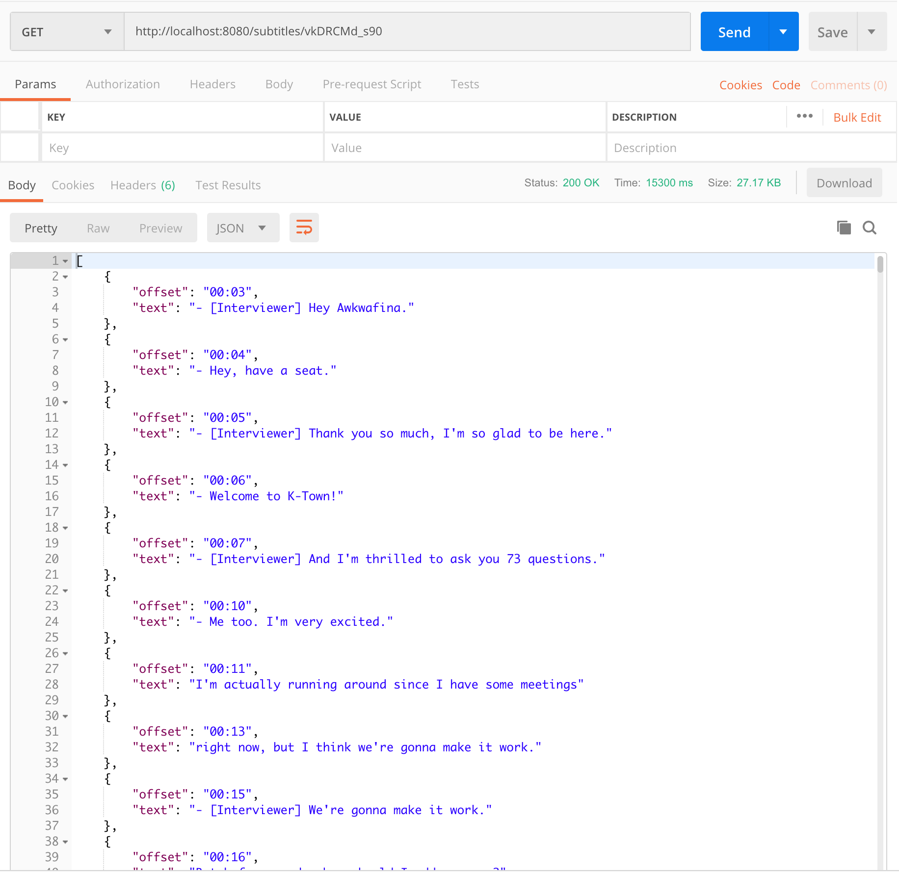
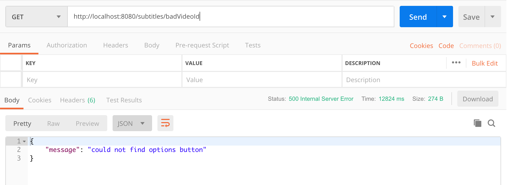

# youtube-transcript-scraper

*Fork*

Fork enabling the subtitles to be fetched using a RESTful API:

- Endpoint: `http://localhost:8080/subtitles/{video_id}`
- Example: `http://localhost:8080/subtitles/vkDRCMd_s90`

- Success (`200 OK`):

- Error (`500 Internal Server Error`):

___

*Origin*

## description
Since YouTube does not provide automatically generated transcripts via its API and normal scraping does not work with YT's ajaxy interface, this script uses browser automation to click through the YouTube web interface and download the transcript file.

## requirements
* a functioning webdriver environment (tested with [https://github.com/mozilla/geckodriver/releases][1]);
* the selenium package for Python;
* a CSV file with a column for video ids as input;

## use
* download script;
* create a directory called "subtitles" and make sure the script can write to it;
* modify captions.py with your CSV filename;
* make sure that webdriver and selenium are installed;
* run the script;

[1]:	https://github.com/mozilla/geckodriver/releases